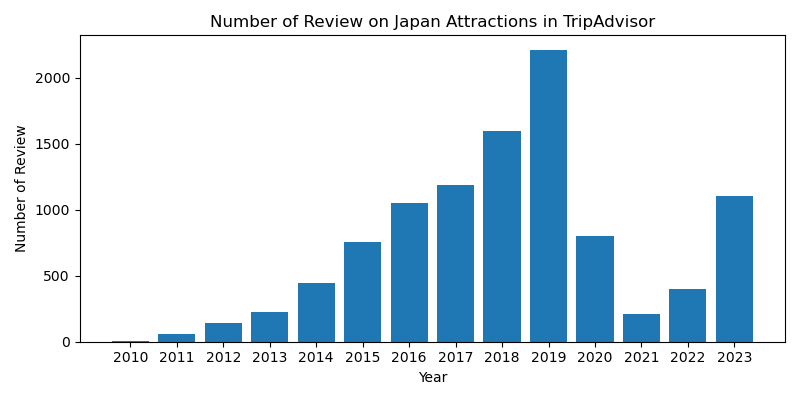

# Project: Feature Sentiment Analysis on Japan Tourist Attraction based on Crowdedness
---
# Problem Statement
---
**Background**: 
After the reopening of international borders post COVID-19 pandemic, number of tourists around the world is booming. Tourists appetite for travels are high after 2-year lockdown to contain the spread of the virus. Despite increase in air tickets and accommodation costs, not to mention the height of inflation, travellers are fighting for airplane seats to some of the popular destinations around the world. [One of them are Japan, who fully lifted its border restriction last April to welcome tourists ahead of Golden Week Holiday](https://www.straitstimes.com/asia/east-asia/japan-lifts-all-covid-19-border-controls-for-golden-week-holidays).

Japan is one the most popular travel destinations in Asia, most notably for its cherry blossom season, winter in the north, and famous theme parks such as disneyland and universal studios. However, high expectations are sometimes met with disappointment, especially during peak season, where waiting lines for tourist attractions could take hours.

To provide a better travel experience, we are working Japanese tourism agency to identify, given a specific month, what is the popularity of different attractions, based on reviews from a popular online travel review website, Tripadvisor. We will use Feature Sentiment Analysis to characterize every review based on waiting time for all the attactions. From this result, the agency could strategize accordingly how to divert tourists from more popular places to the lesser ones to avoid overcrowding.

**Our Goals**:
* To collect sufficient users review data from Tripadvisor through webscrapping.
* Generate sentiment measurement (ground truth) on "crowdedness" based on those reviews. 
* Create a model to accurately predict the sentiment score for production use.
    * We will initiate with Multinomial Naive Bayes algorithm as our baseline model, and iterate through various hyperparameters to get optimum result.
    * We will then compare baseline model with Random Forest model, with consideration that more complex algorithm may be needed to accurately predict the sentiment.

# Data Extraction
--- 
Data are extracted from TripAdvisor on [Things to Do in Japan](https://www.tripadvisor.com/Attractions-g294232-Activities-oa0-Japan.html) page.  

We are scrapping 100 reviews from each of top 300 attractions that are available in the website using [MechanicalSoup](https://mechanicalsoup.readthedocs.io/en/stable/tutorial.html).

Since the reviews are located at subpages of each attraction page, below is the illustration on how to identify the reviews that are being extracted.

Below are the list of features extracted from the website:
* attraction name
* city
* address
* review
* date (which is further categorized into year and month in separate columns)

# Data Cleaning
---
* There is one attraction with empty city column. Since it is only 1 of 300 attractions, it will not have significant impact for the number of data that we have. These empty rows are dropped.
* There is also unexpected ~50% duplicated data. But after investigation, there is no pattern in the duplicated rows, suspect it is related to how the website display the data related, not code related. Decided to work with the remaining 12k data, which should be sufficient.
* Date column is not clean during scraping which includes some string values. This is addressed by slicing and subsequently converting to datetime data-type.
* (This is later discovered during location coordinate generation) Noticed 4 addresses with systematical error. Instead of the correct address, it shows random word such as 'Visit website', 'Call', 'Email', 'Contact'. 2475 entries that contain these addresses are removed from the main dataframe.
# Feature Engineering
--- 

## Tokenize, Lemmatize, Stop Words
To identify every word in the reviews accurately and consistently, we are doing some treatment on `review` feature:
1. Tokenizing: break down reviews (string) into individual words (substring) using RegexpTokenizer
2. Stop Word Removal: to remove insignificant english words using stopwords from nltk library
3. Lemmatizing: filtering english words that are very common but do not provide useful information for text analysis procedures using WordNetLemmatizer also from nltk library.

## Sentiment Analysis
In this section, we generate sentiment scores that act as the ground truth value (1 = crowded, 0 = not crowded). Below are the steps taken:
* Identify suitable keywords from original review column.
* Check 'negated' version, preferrably <20% of total to assign sentiment correctly. Because when we engineer the review (remove stop words), we have no control over the negated portion.
* When we transform the data in the later section, need to adjust hyperparameter (max_features, min_df, max_df) to ensure that those words are captured in order to model accurately.

3 suitable keywords identified: `crowd`,`queue`,`wait`

After extraction is done, observe there is data imbalance between crowded and not crowded classes. This could potentially result in inaccurate and unreliable results. Need to consider assigning class weight or resampling by generating synthetic data points technique during train-test split.

## Generate Location Coordinate from Google Map API
We would like to get coordinate (latitude, longitude) information from each attraction to visualize the sentiment score of the attractions. We are using [Google Map API](https://developers.google.com/maps) to generate this data by passing `address` feature into the algorithm.

# Exploratory Data Analysis
--- 

* Because data is scraped directly from Tripadvisor website, it follows pattern where fewer reviews are extracted further into the past (2019 --> 2010)
* However, based on chart above, fewer reviews are seen from 2020 and further down in 2022, which is highly likely due to border restriction where COVID-19 pandemic was at its peak.
* Increasing number of reviews are seen from 2022 onwards when vaccines effectiveness was kicking in and countries are starting to welcome more tourists.

* Based on distribution across different months, we can see that more reviews are coming from March-May and October-January.
* This is when Japan is famous of its cherry blossom season which is happening during spring, and end-beginning of the year is winter season which is also a popular among tourists.
* We would also expect these months to be more crowded as more number of reviews implying more number of tourists.

* As expected, we see similarity of crowdedness in annual trend, where spring and winter periods are most crowded.

* Based on the size of markers (large --> more crowded), we can see that more crowded places are distributed around central Japan, more specifically Tokyo and Kyoto.

# Data Modeling and Evaluation
* We initiate the modeling process by using Multinomial Naive Bayes with CountVectorizer. The hyperparemeters used are based on those that will successfully generate the keywords to ensure correct sentiment is being identified by the model. This first model has relatively low precision (0.37).
* In next iteration, we replace CountVectorizer with TF-IDF Vectorizer. While CountVectorizer captures the frequency of words used in positive or negative sentiment contexts, TF-IDF Vectorizer captures the significance of sentiment-specific words that might not occur as frequently but carry strong sentiment signals.
    * However, recall score is significantly worse with only 0.13. This model fails to predict 'crowded' reviews (TP). Suspect because the 'crowdedness' sentiment score (y_true) is defined based on limited words, while TFIDF Vectorizer analyzed the weight of each words based on their occurrence in the corpus. The harmonization between those two may not be sufficient.
* 3rd iteration use CountVectorizer again, and use random forest as estimator. It has significantly better recall score of 0.86. Since we have a severe data imbalance in our sentiment classes, random forest may address that by assigning weights to the minority class.

Confusion Matrix of Random Forest (CountVectorizer)

model | transformer | estimator | precision | recall | f1
---|---|---|---|---|---
model #1 (baseline) | cvec (max_fea = 1000, df_min= 5, df_max = 0.8, ngram = 1,1) | multiNB | 0.37 | 0.76 | 0.5
model #2 | tvec (max_fea = 1000, df_min= 5, df_max = 0.8, ngram = 1,2) | multiNB | 1 | 0.13| 0.23
model #3 | cvec (max_fea = 1000, df_min= 5, df_max = 0.8, ngram = 1,1) | random forest (n_est = 100, max_depth = 50) | 1 | 0.88 | 0.92

# Conclusion and Recommendation
---
**Conclusion:**
* Tripadvisor is a good platform to extract sufficient data and timeframe for this sentiment analysis on crowdedness.
* Despite using limited keywords (3), the sentiment score is able to generate consistent trend as seen in EDA section of this study.
* TFIDF Vectorizer does not perform well in this study, suspect because insufficient keywords are defined across the corpus. This may cause the vectorizer to put emphasis on other words. 
* Because of the nature of imbalance classes, random forest yields better accuracy. This is achieved throught adjusted class weights on the minority class.

**Using both sentiment score and optimized model, our stakeholder is able to strategize campaigns to ensure that local/foreign tourists have the best travel experience in the country.**
   
**Recommendation/Future Enhancement:**
* Feature Sentiment Analysis could be further enhanced, currently only rely on limited number of keywords.
* When more keywords are identified, TFIDF vectorizer would complement better in terms of adjusted weightage.
* To further address class imbalance, popular technique such as SMOTE (Synthetic Minority Over-sampling Technique) may help by generating synthetic data points for the minority class.

# Reference 
---
* StraitsTimes: [Japan lifting border controls](https://www.straitstimes.com/asia/east-asia/japan-lifts-all-covid-19-border-controls-for-golden-week-holidays)
* Cartography Vector: [Japan GeoJSON](https://cartographyvectors.com/map/361-japan)
* World Atlas : [Japan Map](https://www.worldatlas.com/r/w960-q80/upload/4a/5a/54/jp-01.jpg)
